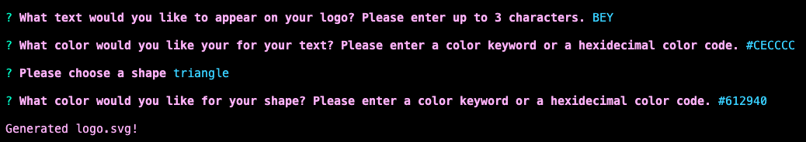
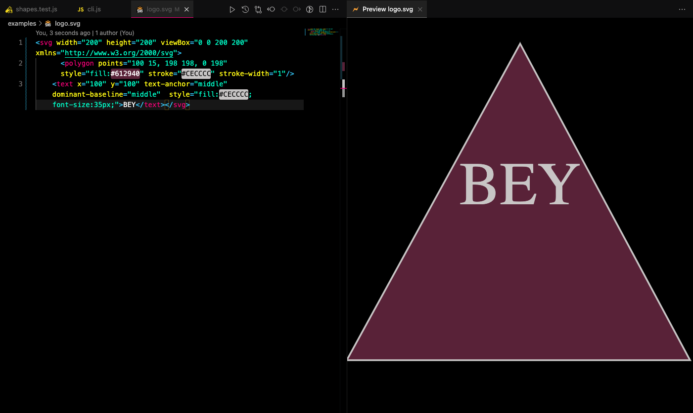
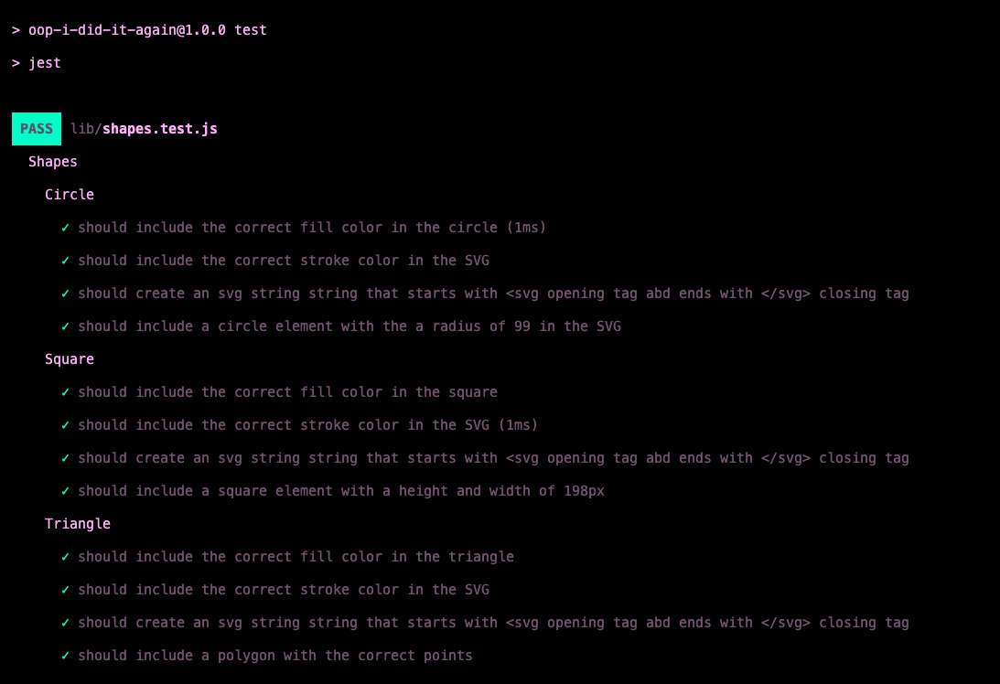
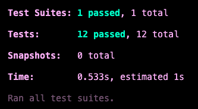

# Logo Generator
  
  

  ## DESCRIPTION
---
  An easy way to generate a simple logo by answering command line prompts!
  
  ## TABLE OF CONTENTS
---
  - [DESCRIPTION](#description)
  - [USAGE](#usage)
  - [RESOURCES](#resources)
  - [LICENSE](#license)
  - [CONTRIBUTING](#contributing)
  - [TESTS](#tests)
  - [QUESTIONS](#questions)
---
    
  - Make sure you have Node.js installed on your computer
  - Clone the repo by typing in the command line: git clone https://github.com/SLAYsian/OOP-I-did-it-again.git
  - In the command line, type: npm i

  
  ## USAGE
---
  - Navigate to the directory of your index.js file
  - In the command line, type: node index.js
  - Answer each prompt that appears in the command line
  - Your logo will generate to the logo.svg file in the examples directory
  - Open the file in your browser to view your new logo!

![Video] (https://drive.google.com/file/d/1PWMk2QIfjElub9zRXrg1Sh1qAUK-UNq7/view)
https://github.com/SLAYsian/OOP-I-did-it-again/assets/127693250/673623be-f991-4aa0-9234-56b9c1a0faad

  ## RESOURCES
---
1. UConn Coding Bootcamp - Module 10 OOP
2. MDN (https://developer.mozilla.org/en-US/)
3. Stack Overflow (https://stackoverflow.co/)
4. UDEMY Jonas Schmedtmann courses (https://codingheroes.io/resources/)
5. UDEMY Dr Angela Yu (https://appbrewery.com/)
6. UDEMY Colt Steele and Stephen Grider - The Modern Javascript Bootcamp Course (2022) (https://www.udemy.com/course/javascript-beginners-complete-tutorial/)
7. W3Schools (https://www.w3schools.com/)

  ## LICENSE
---
  MIT

  ## CONTRIBUTING
---
  If you are interested in contributing to this project, please follow these steps:
  - Fork the repo on GitHub
  - Clone the project to your own machine
  - Commit changes to your own branch
  - Push your work back up to your fork
  - Submit a pull request for review

  ## TESTS
---
  There are tests for each shape. You can enter npm test in your command line to run the tests.

  ## QUESTIONS
---
  To see more of my work, please visit my GitHub page: https://github.com/slaysian

  If you have any questions, please contact me at katharinemg@gmail.com
